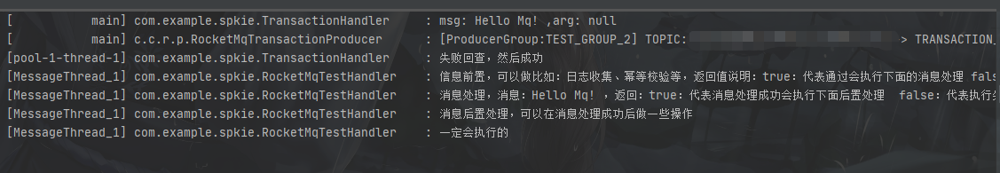
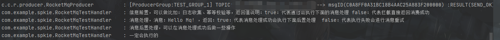

## 简介

目的在于简化Rocketmq生产和消费的启动流程，通过相关配置以及注解就可以做到消息发送和消费，包含以下功能：

**生产者：**
  - 同步消息
  - 异步消息
  - 单向消息
  - 顺序消息
  - 事务消息

**消费者：**
  - 普通消息消费
  - 顺序消息消费

## 使用说明

### 生产者

- **普通消息**
  1. 配置文件中配置：

```Java
rocket-mq:
  producer:
    enabled: true
    # 生产者namesrv全局配置
    namesrv-addr: xxxxxx
    default-mq-producer-configs:
      # namesrvAddr这里也可以单独配置（以这个为准，优先级高）
      - namesrvAddr: xxxxxx
        producerGroup: TEST_GROUP_1
      # 可选配置如下
#        retryTimesWhenSendFailed: 3  重试次数 默认3次
#        sendMsgTimeout: 5000         超时时长，单位毫秒  默认；5s
      # 可以配置多个
      # namesrvAddr这里也可以不配置，则上面全局的为准，两者必配一个
      - producerGroup: TEST_GROUP_2
```
  2. 在需要发消息的地方，引入即可使用

```Java
// 使用自定义注解引入，非spring注解，而且需要说明是哪个生产者
@RocketResource(producerGroup = "TEST_GROUP_1")
private RocketMqProducer rocketMqProducer1;

@RocketResource(producerGroup = "TEST_GROUP_2")
private RocketMqProducer rocketMqProducer2;

```
  3. 消息发送

```Java
// 同步发送
rocketMqProducer1.syncProducerSend("TOPIC","Hello Mq!");
// 异步发送
rocketMqProducer1.asyncProducerSend("TOPIC","Hello Mq!");
// 单向发送
rocketMqProducer1.oneWayProducerSend("TOPIC","Hello Mq!");
// 同步顺序消息
rocketMqProducer1.syncProducerOrderSend("TOPIC","tag","Hello Mq!","选择队列的Key");
// 异步顺序消息
rocketMqProducer1.asyncProducerOrderSend("TOPIC","tag","Hello Mq!","选择队列的Key");
```
  4. 启动成功可以看到日志：

     
- **事务消息**
  1. 大体上与普通消息一致，配置只需要加上是否支持事务：

```Java
rocket-mq:
  producer:
    enabled: true
    # 生产者namesrv全局配置
    namesrv-addr: xxxx
    default-mq-producer-configs:
      # namesrvAddr这里也可以单独配置（以这个为准，优先级高）
      - namesrvAddr: xxxx
        producerGroup: TEST_GROUP_1
      # 可选配置如下
#        retryTimesWhenSendFailed: 3  重试次数 默认3次
#        sendMsgTimeout: 5000         超时时长，单位毫秒  默认；5s
      # 可以配置多个
      # namesrvAddr这里也可以不配置，则上面全局的为准，两者必配一个
      - producerGroup: TEST_GROUP_2
        # 是否是事务生产者  默认不是（事务生产者可以发送事务消息）
        supportTransaction: true
```
  2. 在需要发消息的地方，引入即可使用（注意事务和非事务的区分）

```Java
// 使用自定义注解引入，非spring注解，而且需要说明是哪个生产者
// 非事务生产者
@RocketResource(producerGroup = "TEST_GROUP_1")
private RocketMqProducer rocketMqProducer1;

// 事务生产者
@RocketResource(producerGroup = "TEST_GROUP_2")
private RocketMqTransactionProducer rocketMqProducer2;

```
  3. 添加事务监听器，实现RocketMqTransactionHandler接口，并打上自定义事务注解@RocketTransactionHandler

```Java
@Slf4j
@RocketTransactionHandler(producerGroup = "TEST_GROUP_2")
public class TransactionHandler implements RocketMqTransactionHandler {
    // 一样受spring容器管理，可以自己注入逻辑处理
    @Resource
    private BeanTest beanTest;

    // 事务处理逻辑,这里的arg参数就是发送消息时的最后那个Object参数
    @Override
    public LocalTransactionState executeLocalTransaction(Message msg, Object arg) {
        log.info("msg: {} ,arg: {} ", JSON.toJSON(new String(msg.getBody(), StandardCharsets.UTF_8)),arg);
        return LocalTransactionState.UNKNOW;
    }

    // 事务的回查处理逻辑
    @Override
    public LocalTransactionState checkLocalTransaction(MessageExt msg) {
        log.info("失败回查，然后成功");
        return LocalTransactionState.COMMIT_MESSAGE;
    }
}
```
  4. 发送事务消息

```Java
rocketMqProducer2.transactionProducerSend("TOPIC","*","Hello Mq!" , null);
```
  5. 结果

     

## 消费者

- **普通消费/顺序消费**

  

  1. 配置开启，这个地址是消费者全局配置

```Java
rocket-mq:
  consumer:
    enabled: true
    namesrv-addr: xxxxx
```
  2. 消费者实现RocketMqMsgHandler接口，打上自定义注解@RocketMqConsumerHandler

```Java
@Slf4j
@RocketMqConsumerHandler(consumerGroup = "TEST_GROUP",subscribes = {@RocketMqSubscribes( topic = "TOPIC")})
public class RocketMqTestHandler implements RocketMqMsgHandler {


    @Override
    public boolean beforeMsgHandler(MessageExt msg) {
        log.info("信息前置，可以做比如：日志收集、幂等校验等，返回值说明：true：代表通过会执行下面的消息处理 false：代表拦截直接返回消费成功");
        return true;
    }

    @Override
    public boolean msgDataHandler(MessageExt msg) {
        log.info("消息处理，消息：{} ，返回：true：代表消息处理成功会执行下面后置处理  false：代表执行失败会进行消息重试", JSON.toJSON(new String(msg.getBody(), StandardCharsets.UTF_8)));
        return true;
    }

    @Override
    public void afterMsgHandler(MessageExt msg) {
        log.info("消息后置处理，可以在消息处理成功后做一些操作");
    }

    @Override
    public boolean exceptionMsgHandler(MessageExt msg,Exception e) {
        log.info("消息异常处理，异常：{} {}，返回：true：消息会进行重试  false：消息不重试",e.getMessage(),e);
        return false;
    }

    @Override
    public void finallyMsgHandler(MessageExt msg) {
        log.info("一定会执行的");
    }
}
```
  3. 这样消费者就已经完成了，看下结果（同样启动成功后，会看到日志）

      
  4. 看下注解说明@RocketMqConsumerHandler

```Java
    /**
     * namesrvAddr 地址 不填则以配置文件为准
     **/
    String namesrvAddr() default "";
    /**
     * 消费组名称
     **/
    String consumerGroup();

    /**
     * 订阅关系 topic 、tag
     **/
    RocketMqSubscribes[] subscribes();

    /**
     * 消费开启最小线程数  默认20
     **/
    int consumeThreadMin() default 20;

    /**
     * 消费开启最大线程数  默认20
     **/
    int consumeThreadMax() default 20;
    /**
     * 批量消费最大条数 默认1条
     **/
    int consumeMessageBatchMaxSize() default 1;
    /**
     * 一次从broker拉取消息条数 默认32条
     **/
    int pullBatchSize() default 32;
    /**
     * 消费超时时间 单位：分钟 默认15分钟
     **/
    int consumeTimeout() default 15;
    /**
     * 消费失败最大重试次数 默认16次
     **/
    int maxReconsumeTimes() default 16;
    /**
     * 是否顺序消费
     **/
    boolean isOrderConsumer() default false;
```

